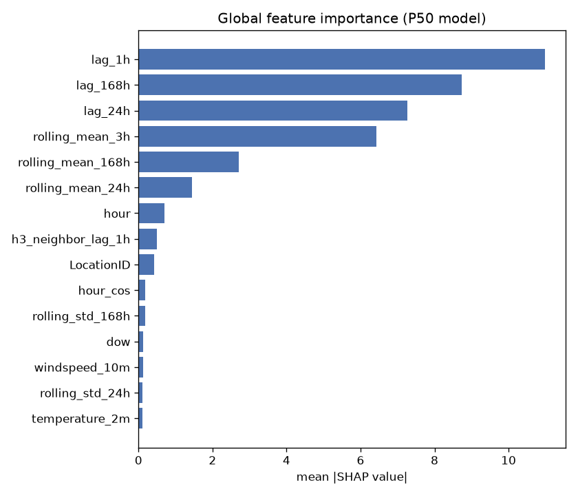
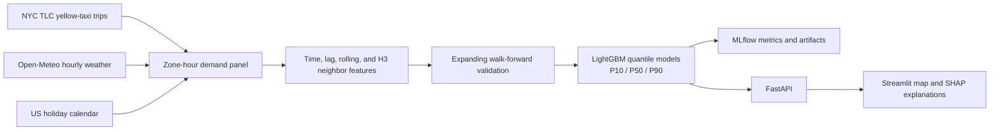

# NYC Taxi Demand Forecasting

A small, reproducible forecasting project built around one practical question:

> How many yellow-taxi pickups should we expect in each NYC taxi zone next hour, and how uncertain is that estimate?

The model predicts hourly pickup demand for 263 NYC TLC zones. It returns a median forecast (`P50`) plus a lower and upper estimate (`P10`, `P90`), rather than pretending that one number is certain. A FastAPI service and Streamlit app make the saved evaluation forecasts explorable by zone and hour.

This is deliberately a batch, single-machine project. It uses public data and ordinary Python tooling; there is no streaming stack or cloud infrastructure hidden behind it.



## Results

The model was evaluated with expanding, walk-forward validation. Each validation week comes strictly after its training data, which matters more here than a complicated model choice.

| Metric | Seasonal-naive baseline | LightGBM | Change |
| --- | ---: | ---: | ---: |
| RMSE | 14.55 | 11.10 | 23.7% lower |
| MAE | 4.61 | 3.59 | 22.2% lower |
| MAPE (non-zero hours) | 65.0% | 50.3% | 22.6% lower |
| P10 pinball loss | 2.246 | 0.795 | 64.6% lower |
| P50 pinball loss | 2.304 | 1.793 | 22.2% lower |
| P90 pinball loss | 2.362 | 0.909 | 61.5% lower |

Figures are averages across five weekly validation folds. The baseline is the demand in the same zone at the same hour one week earlier. Full fold-level results are in [reports/cv_metrics.json](reports/cv_metrics.json).

## How it works



The training table contains 372,408 zone-hour observations (263 zones x 1,416 hours). It includes zero-demand hours rather than dropping them; about 47% of the observations are zero.

### Features

- Calendar: hour, day of week, month, weekend, and cyclical time encodings.
- History: 1-, 24-, and 168-hour lags plus 3-, 24-, and 168-hour rolling mean and standard deviation features.
- External context: temperature, precipitation, snowfall, wind speed, and US federal-holiday indicators.
- Spatial context: each TLC zone is assigned an H3 resolution-8 cell; a neighbor-demand feature summarizes nearby zones' prior-hour demand.

Lag and rolling features are shifted before aggregation, so a row can only use information that would have been available at its forecast time.

## Data

- [NYC TLC Yellow Taxi trip records](https://www.nyc.gov/site/tlc/about/tlc-trip-record-data.page), January-February 2025. After filtering missing and unknown pickup zones, the pipeline retains 7,034,591 trips.
- [Open-Meteo historical weather API](https://open-meteo.com/en/docs/historical-weather-api), hourly weather at a Central Park reference point.
- US federal holidays from the [`holidays`](https://pypi.org/project/holidays/) Python package.
- [NYC TLC taxi-zone lookup and shapefile](https://www.nyc.gov/site/tlc/about/tlc-trip-record-data.page).

The original project outline proposed NOAA weather. I used Open-Meteo because it is free, documented, and requires no API key. Weather is city-level, so every zone receives the same hourly weather values.

## Run it locally

Requirements: Python 3.10+ and about 250 MB of disk space for the downloaded trip files and generated artifacts.

```bash
git clone <your-repository-url>
cd nyc-taxi-demand-forecasting

python3 -m venv .venv
source .venv/bin/activate
python -m pip install --upgrade pip
python -m pip install -r requirements.txt
```

Run the pipeline in order:

```bash
python -m src.ingest.download_tlc
python -m src.ingest.zones
python -m src.ingest.download_weather
python -m src.features.build_panel
python -m src.features.eda                 # optional EDA charts
python -m src.modeling.train               # validation, MLflow, saved models
python -m src.explain.generate_shap_report # global SHAP chart
```

Start the application in two terminals after training:

```bash
uvicorn src.api.main:app --reload --port 8000
```

```bash
streamlit run src/dashboard/app.py
```

Open `http://127.0.0.1:8501` for the dashboard and `http://127.0.0.1:8000/docs` for the API documentation. To inspect experiments locally, run `mlflow ui --backend-store-uri ./mlruns`.

## Repository layout

```text
src/ingest/       Download trips, taxi-zone metadata, and weather
src/features/     Build the zone-hour panel, EDA, and causal features
src/modeling/     Baseline, walk-forward splits, training, and metrics
src/explain/      Global and single-prediction SHAP helpers
src/api/          FastAPI application
src/dashboard/    Streamlit application
reports/          Validation metrics, project notes, and committed charts
data/             Downloaded and derived files (not committed)
models/           Trained model artifacts (not committed)
mlruns/           Local MLflow runs (not committed)
```

## Scope and limitations

- The API replays predictions over a precomputed held-out window rather than generating an arbitrary future forecast. A production version would need a scheduled feature-refresh and scoring job.
- Weather comes from one NYC reference location, not station-level or zone-level measurements.
- The map uses zone centroids and demand-sized bubbles; it is not a zone-polygon choropleth.
- Quantile models are trained independently. The API sorts the three returned values to preserve `P10 <= P50 <= P90`; formal calibration and joint quantile modeling would be useful next steps.
- The short January-February sample is enough to demonstrate the pipeline, but not enough to learn annual seasonality or unusual events robustly.

For the methodology and a few implementation notes, see [reports/REPORT.md](reports/REPORT.md).

## License

Released under the [MIT License](LICENSE).
